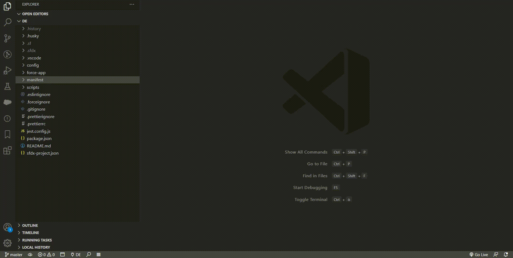
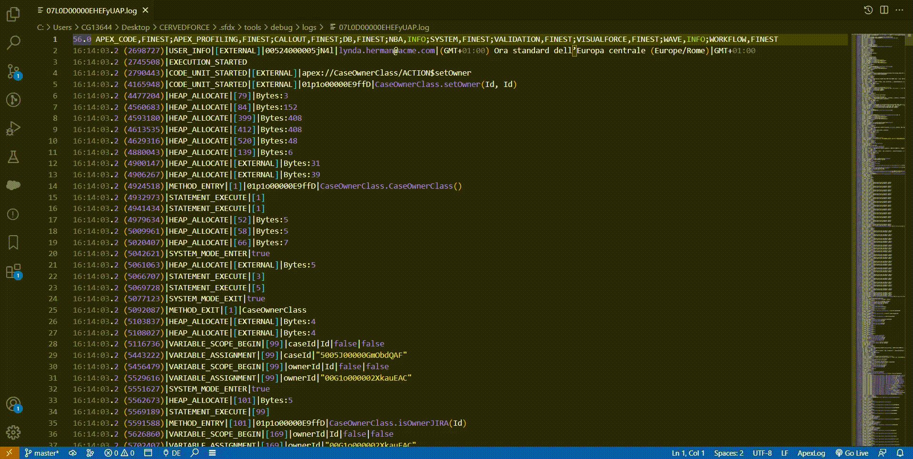

# SFDX Lens

The quickest way to set up trace flags for a chosen active Salesforce user in any connected org. Without leaving VSCode.
 
 
🔥**14-03-2023  New command added** - SFDX Lens: Log Analysis (Beta) 🔥

Now with the possibility to visualize the log in its parts, closing the gap between setting trace flags, getting the logs in vscode and view instantly what's firing.

Now you have the full picture!
 
 

Set up a trace flag and download the log:

 
Perform a log analysis:

 
 

## Requirements

- [Salesforce CLI](https://developer.salesforce.com/tools/sfdxcli) installed
- A Salesforce DX project
 
 

## Commands / Features

All features are accessible from the VS Code command palette using the shortcut `Ctrl+Shift+P` (Windows) or `Cmd+Shift+P` (Linux/MacOS) while in a SFDX Project

`SFDX Lens: Debug user`

Lets the current user to pick a name from a list of Salesforce active users in the current connected org, then creates a Trace Flag for that user.

This feature is even available from the 🔎 button icon in VSCode's status bar on the left side.

`SFDX Lens: Debug user from Org`

Lets the current user to pick an Org name from a list of Connected Salesforce Orgs, then executes the same steps of the Debug user command on the chosen Org.

`SFDX Lens: Log Analysis (Beta)`

When invoked on an Apex Log, it opens a new page tab showing the log's timeline, divided in each part proportional to its duration.
Every log part is clickable and upon clicking the corresponding code is displayed, up to the first 100000 characters for performance reasons.

You can search the code for a particular string through a fixed search bar displayed on the right side of the page.
 
 
## Notes

- **Users** All active users are listed and can be traced

- **Scopes** Upon the first trace flags creation, this extension creates a *SFDX_Lens* Debug log level with all the scopes set to "Finest" to guarantee maximum logging debug level.

- **Trace Flags** Whenever a user is put under debug, the extension checks if another trace flag is already created by extension and if so, it updates it to prevent trace flags littering

- **Log Colors** Log colors are chosen randomly

- **Log Labels** Generic Apex code (not linked to Validation Rules, Triggers, etc.) is labeled "Apex Code 1/2/3/etc."
 
 

## Release Notes

### 0.0.4

Initial release

### 0.0.5

Explicitly retargeted MAX_LIMIT_EXCEEDED error when setting up a trace flag in an org hitting the max debug log size limit

### 1.0.0

Though in Beta, the SFDX Lens: Log Analysis command is released, giving the extension the effective ability to set up and inspect logs

## Issues
You can report issues [here](https://github.com/pcarrara21/SFDXLens-Public/issues)