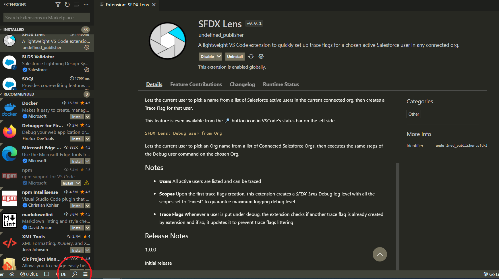
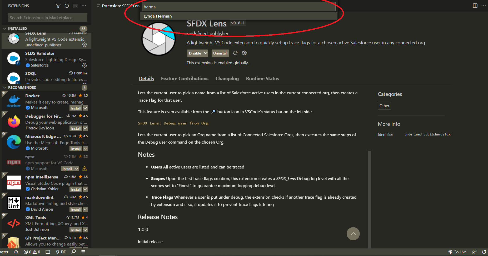
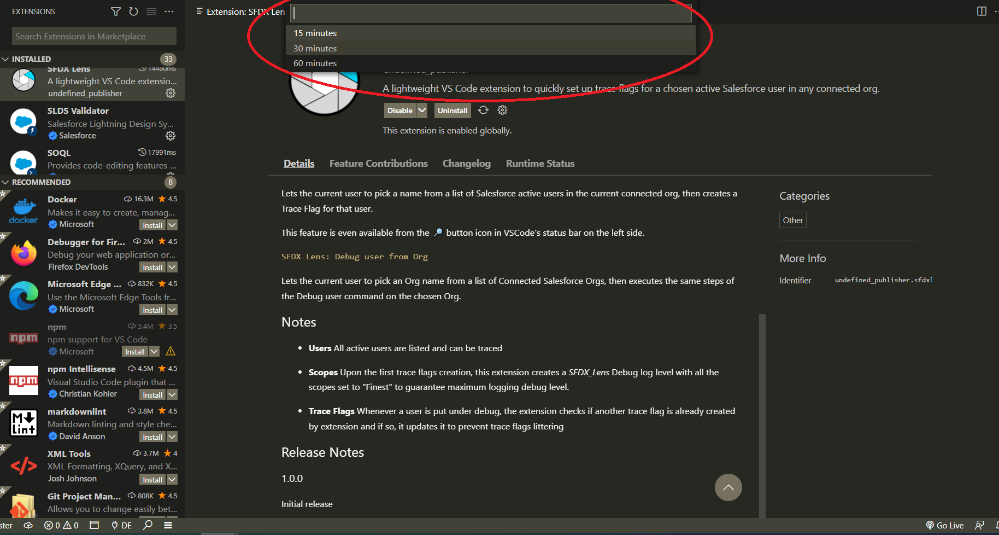
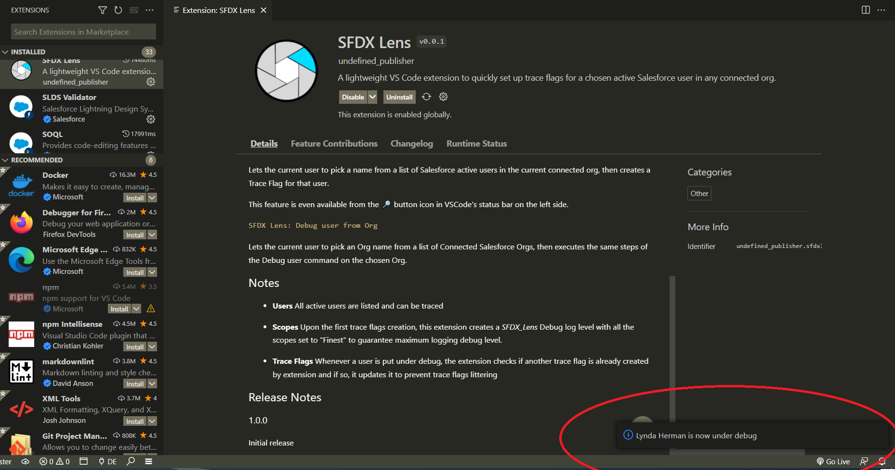
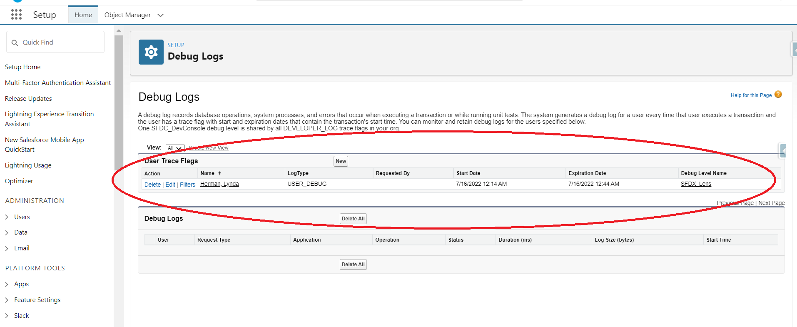

# SFDX Lens

A lightweight VS Code extension to quickly set up trace flags for a chosen active Salesforce user in any connected org.

## Requirements

- [Salesforce CLI](https://developer.salesforce.com/tools/sfdxcli) installed
- A Salesforce DX project

## Features

All features are accessible from the VS Code command palette using the shortcut `Ctrl+Shift+P` (Windows) or `Cmd+Shift+P` (Linux/MacOS) while in a SFDX Project

`SFDX Lens: Debug user`

Lets the current user to pick a name from a list of Salesforce active users in the current connected org, then creates a Trace Flag for that user.

This feature is even available from the 🔎 button icon in VSCode's status bar on the left side.

`SFDX Lens: Debug user from Org`

Lets the current user to pick an Org name from a list of Connected Salesforce Orgs, then executes the same steps of the Debug user command on the chosen Org.

## Notes

- **Users** All active users are listed and can be traced

- **Scopes** Upon the first trace flags creation, this extension creates a *SFDX_Lens* Debug log level with all the scopes set to "Finest" to guarantee maximum logging debug level.

- **Trace Flags** Whenever a user is put under debug, the extension checks if another trace flag is already created by extension and if so, it updates it to prevent trace flags littering

## Release Notes

### 0.0.4

Initial release

## Screenshots

